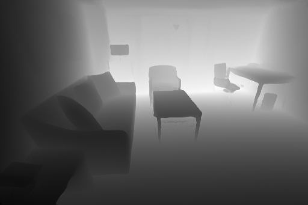
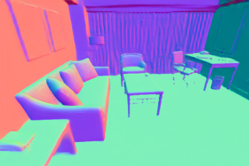
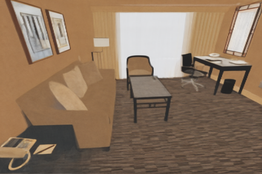
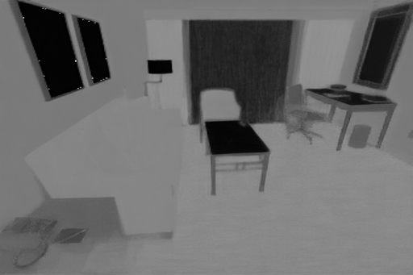
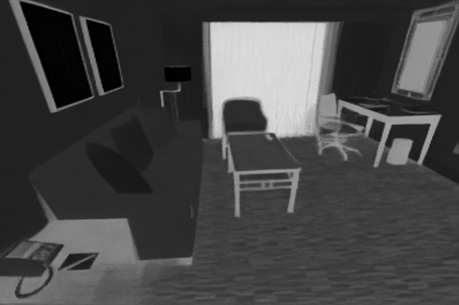
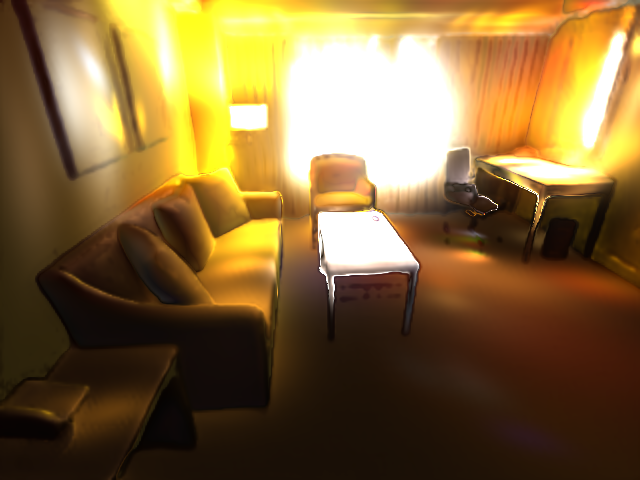
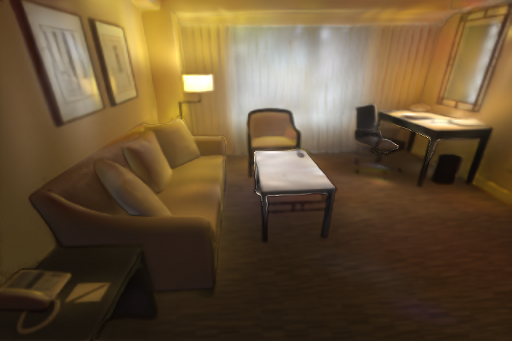

<p align="center">

  <h1 align="center">Intrinsic Image Diffusion for Indoor Single-view Material Estimation</h1>
  <p align="center">
    <a href="https://peter-kocsis.github.io/">Peter Kocsis</a>
    ·
    <a href="https://www.vincentsitzmann.com/">Vincent Sitzmann</a>
    ·
    <a href="https://niessnerlab.org/members/matthias_niessner/profile.html">Matthias Niessner</a>
  </p>
  <h2 align="center">CVPR 2024</h2>
  <h3 align="center"><a href="https://arxiv.org/abs/2312.12274">Paper</a> | <a href="https://peter-kocsis.github.io/IntrinsicImageDiffusion/">Project Page</a> </h3>
  <div align="center"></div>
</p>

<p align="center">
  <a href="">
    
  </a>
</p>

<p align="center">
We utilize the strong prior of diffusion models and formulate the material estimation task probabilistically. Our approach generates multiple solutions for a single input view, with much more details and sharper features compared to previous works. 
</p>
<br>

## Structure
Our project has the following structure:

```
├── configs               <- Hydra config files
├── data                  <- Datasets
├── docs                  <- Project page
├── iid                   <- Our main package for Intrinsic Image Diffusion
│   ├── geometry_prediction   <- Code for geometry prediction
│   ├── lighting_optimization <- Code for lighting optimization
│   └── material_diffusion    <- Code for material diffusion
├── logs                   <- Hydra and WandB logs
├── models                 <- Model and config folder
├── res                    <- Documentation resources
├── environment.yaml       <- Env file for creating conda environment
├── LICENSE
└── README.md
```

# Installation
To install the dependencies, you can use the provided environment file:
```
conda env create -n iid -f environment.yml
conda activate iid
pip install stable-diffusion-sdkit==2.1.5 --no-deps
```

#### (Optional) XFormers
For better performance, installing [XFormers](https://github.com/facebookresearch/xformers) is recommended.
```
conda install xformers -c xformers
```
The code has been tested with Ubuntu 22.04.3 LTS and Ubuntu 20.04.3 LTS with RTX_3090 and A4000 GPUs. 


### Model
#### Material Diffusion
Download our Material Diffusion model to the `models` folder.
```
mkdir -p models/material_diffusion
wget "https://syncandshare.lrz.de/dl/fiAomi6K8g5dywJBwAxFiZ/iid_e250.pth" -O "models/material_diffusion/iid_e250.pth"
```

#### OmniData
For our full pipeline, download the OmniData model to the `models` folder.
```
mkdir -p models/geometry_prediction
wget "https://zenodo.org/records/10447888/files/omnidata_dpt_depth_v2.ckpt?download=1" -O "models/geometry_prediction/omnidata_dpt_depth_v2.pth"
wget "https://zenodo.org/records/10447888/files/omnidata_dpt_normal_v2.ckpt?download=1" -O "models/geometry_prediction/omnidata_dpt_normal_v2.pth"
```

# Logging
The code supports logging to console and [WandB](https://wandb.ai/site). 
The default config is to log to WandB, but the presented commands override this to console, so you can run them without an account. 
If you wish to change to WandB, drop the `logger=console` argument from the commands and edit `configs/logger/wandb.yaml` with your information.


# Training
To train our model, first, the dataset and the pre-trained model needs to be prepared. 

## Dataset
Our model has been trained on the 85 FOV images of the [InteriorVerse](https://interiorverse.github.io/#download) synthetic indoor dataset. Please refer to the official instructions to download the dataset. The dataset should have the following structure:
```
...
├── data                   <- Datasets
│   ├── InteriorVerse        <- InteriorVerse dataset
│   │   └── dataset_85         <- 85FOV dataset
│   │        ├── train.txt        <- List of training scenes
│   │        ├── val.txt          <- List of validation scenes
│   │        ├── test.txt         <- List of test scenes
│   │        ├── L3D197S21ENDIMKITJAUI5NYALUF3P3XC888      
│   │        └── ...
...
```

## Pre-trained Stable Diffusion Model
To train our model, we fine-tune a pre-trained Stable Diffusion model. Use the following command to get the pre-trained model. 
```
mkdir -p models/stable_diffusion
wget "https://huggingface.co/stabilityai/stable-diffusion-2-depth/resolve/main/512-depth-ema.ckpt" -O "models/stable_diffusion/512-depth-ema.ckpt"
```

## Train
Our model was trained for 250 epochs with a total batch size of 40 on 4 A100 GPUs, which took around 7 days. For a different setup, you can modify the training config. Run the following command to train the model.
``` 
python -m iid.train
```


# Inference
The full pipeline consists of three stages: geometry prediction, material diffusion and lighting optimization.
You can run all stages together with the following command **(WandB logging is recommended)**.
THis script loads the test image from `data/test/im` folder, predicts the geometry and materials and extends the dataset with the predictions, then optimizes for the lighting. 
For more details, you can check `configs/intrinsic_image_diffusion.yaml`.
```
python -m iid
```
Expected run results can be found in this [WandB report](https://api.wandb.ai/links/peterkocsis/3pbbalc7).

## Stage 1 - Geometry Prediction
This script will load the test image from the `res` folder, predicts the depth and normals and saves it to the `output` folder. 
To predict the geometry, you can use the following command. For more details, you can check `configs/stage/geometry_prediction.yaml`.
```
python -m iid.geometry_prediction logger=console
```
Input            |            Depth             | Normals
:-------------------------:|:----------------------------:|:-------------------------:
  |  |  


## Stage 2 - Material Diffusion
Running the model requires at least 10GB of GPU memory. 
This script will load the test image from the `res` folder, predicts the depth and normals and saves it to the `output` folder
You can run it with the following command. For more details, you can check `configs/stage/material_diffusion.yaml`.
```
python -m iid.material_diffusion logger=console
```
By default, the script predicts 10 material explanations and computes the average. 

Input            |             Albedo             |                 Roughness        |                 Metallic              
:-------------------------:|:---------------------------:|:----------------------------------------:|:----------------------------------------:
  |  |  |  


## Stage 3 - Lighting Optimization
The lighting optimization part uses [PyTorch Lightning](https://github.com/Lightning-AI/pytorch-lightning) with iterative pruning and early stopping. 
As more and more light sources are pruned, the faster the iteration time becomes. 
It requires predicted geometry and materials.
This script will load the dataset from the `data/test` folder, optimizes for the lighting (envmap and 48xSG point lights) and then saves the checkpoints to `data/test/lighting`. 
The easiest way to get the predictions prepared is to run the full pipeline or copy the data from `data/test_out`.
You can run it with the following command. For more details, you can check `configs/stage/lighting_optimization.yaml`.
```
python -m iid.lighting_optimization logger=console
```
Input            |              Shading               | Rerendering
:-------------------------:|:--------------------------------:|:-------------------------:
  |  |  


# Rendering
After running the full pipeline, you can render the results with the following command. 
This script will load the dataset from the `data/test_out` folder and the optimized lighting model from `data/test_out/lighting/0.ckpt`, then rerender the scene using the full decomposition.
```
python -m iid.test logger=console
```

# Acknowledgements
This project is built upon [Latent Diffusion Models](https://github.com/CompVis/latent-diffusion), we are grateful for the authors open-sourcing their project. 
We used [Hydra](https://github.com/facebookresearch/hydra) configuration management with [Pythorch Lightning](https://github.com/Lightning-AI/pytorch-lightning). 
Our model was trained on the high-quality [InteriorVerse](https://interiorverse.github.io/) synthetic indoor dataset. 
Rendering model was inspired by [Zhu et. al. 2022](https://github.com/jingsenzhu/IndoorInverseRendering). 
Our full pipeline uses [OmniData](https://github.com/EPFL-VILAB/omnidata) for geometry prediction.

# Citation
If you find our code or paper useful, please cite
```bibtex
@article{kocsis2024iid,
  author    = {Kocsis, Peter and Sitzmann, Vincent and Nie\{ss}ner, Matthias},
  title     = {Intrinsic Image Diffusion for Indoor Single-view Material Estimation},
  journal   = {Conference on Computer Vision and Pattern Recognition (CVPR)},
  year      = {2024},
}
```